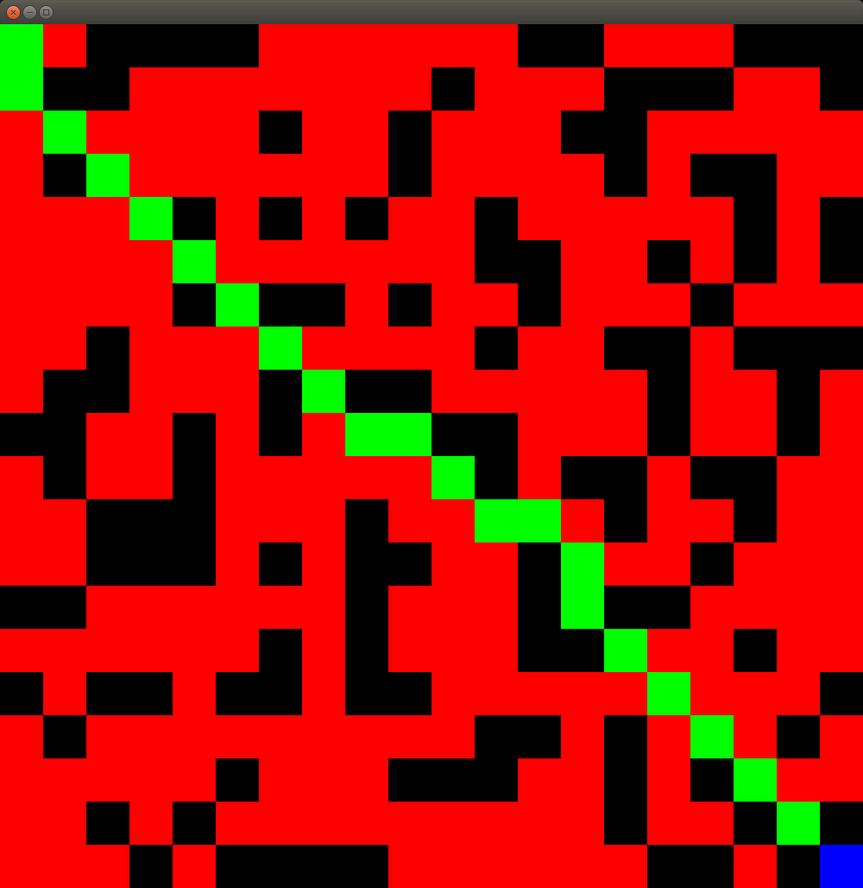

Reitinhakualgoritmien vertailu
==============================

Tämän ohjelman tarkoituksena on graafisen käyttöliittymän avulla havainnollistaa eri reitinhakualgoritmien tehokkuutta. Harjoitustyössä joudun implementoimaan ainakin seuraavia tietorakenteita ja algoritmeja

0. A*
0. Dijkstra
0. BFS & DFS
0. Arraylist, Linkedlist, Queues
0. Some sorting algorithms for priority queues

graafisen käyttöliittymän ensimmäinen versio
--------------------------------------------

lopullinen versio tulee olemaan paintin kaltainen työkalu, jossa voi piirtää esteitä, valita alku ja päätepisteet, käytettävän algoritmin sekä myös valita valmiiksi luoduista labyrinteistä mieleisensä.

viikkoraportti 2
----------------

tämän viikon deadline pääsi yllättämään, olin varautunut, että se on tiistaina kuten ensimmäiselläkin viikolla. my bad. ohjelmaa on kuitenkin tehty ja luokat kommentoitu, testit eivät valitettavasti ehtineet vielä mukaan. Ohjelmarunko on hyvällä mallilla ja aloitinkin jo tekemään muutamia javan valmiita tietorakenteita korvaavia jutskia, esim prioriteettijonon jota ainakin a* tarvitsee. aikavaativuudet yritän minimoida kurssin aikana, tällä hetkellä hexpriorityqueue käyttää bubblesorttia joka on vain proof of conseptina siellä.

Jatkan nyt projektin kehittämistä, luomalla ihan aluksi testit, toivottavasti ne ehtivät paikalle ennen kuin ohjaaja tämän tarkistaa.

viikkoraportti 3
----------------

A* toimii nyt kunnolla ja ohjelman runko sekä muoto ovat alkaneet saamaan lopullisia piirteitä, testejä on vitaaleille luokille. Prioriteettijono toimii nyt testatusti, joskin sitä voisi hieman viritellä. Joistakin luokista olen luopunut. Omia tietorakenteita tulee ensi viikon aikana ainakin luoda: lista lisäys ja poisto operaatioilla sekä 0(1) ajassa toimiva hajautuskartta.

viikkoraportti 4
----------------

vertaisarviointi tehty, omaan koodiin tullut lisää testejä sekä NodeQueue luokka korvaa nyt javan arraylistin sekä HexMap HashMapin. tunteja tällä viikolla on tullut liian vähän, yritän tällä viikolla antaa muilta tekemisiltä tälle projektille enemmän aikaa.

viikkoraportti 5
----------------

mazegenerator toimii nyt alustavasti ja astar ratkoo sen nätisti.

